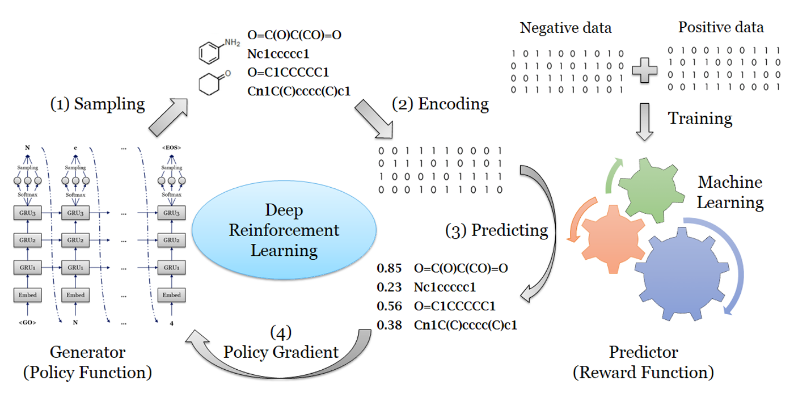
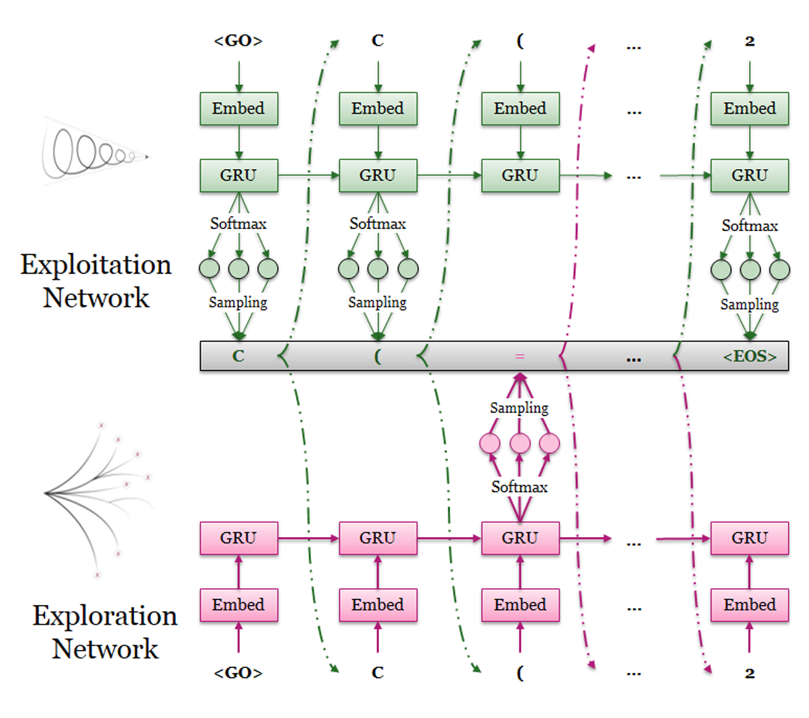
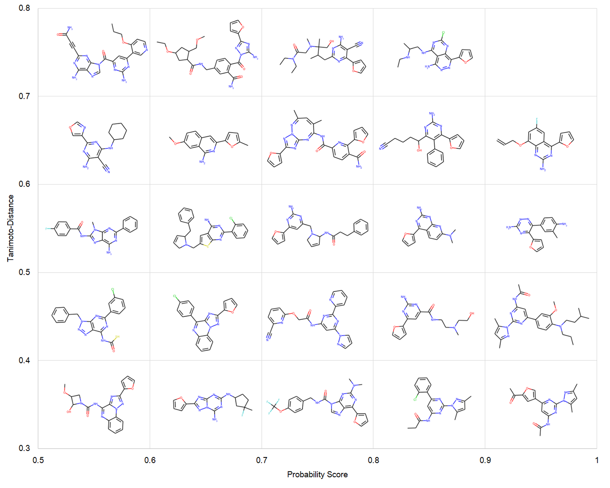

DrugEx RELEASE NOTES
====================

DrugEx (Drug Explorer): An explaration strategy improves the diversity of de novo drug design using deep reinforcement learning

By Xuhan Liu & Gerard J.P. van Westen, on November 1st 2018

Please see the LICENSE file for the license terms for the software. Basically it's free to academic users. If you do wish to sell the software or use it in a commercial product, then please contact the following E-mails:

   Xuhan Liu (First Author): x.liu@lacdr.leidenuniv.nl 

   or

   Gerard J.P. van Westen (Correspondent Author): gerard@lacdr.leidenuniv.nl

Introduction
=============
Over the last five years deep learning has progressed tremendously in both image recognition and natural language processing. Now it is increasingly applied to other data rich fields. In drug discovery, recurrent neural networks (RNNs) have been shown to be an effective method to generate novel chemical structures in the form of SMILES. However, ligands generated by current methods have so far provided relatively low diversity and do not fully cover the whole chemical space occupied by known ligands. Here, we propose a new method (DrugEx) to discover de novo drug-like molecules. DrugEx is an RNN model (generator) trained through a special exploration strategy integrated into reinforcement learning. As a case study we applied our method to design ligands against the adenosine A2A receptor. From ChEMBL data, a machine learning model (predictor) was created to predict whether generated molecules are active or not. Based on this predictor as the reward function, the generator was trained by reinforcement learning without any further data. We then compared the performance of our method with two previously published methods, REINVENT and ORGANIC. We found that candidate molecules our model designed, and predicted to be active, had a larger chemical diversity and better covered the chemical space of known ligands compared to the state-of-the-art.

Workflow
========

Exploration Strategy
====================

Examples
=========

Dependencies
============
Firstly, ensure that the version of your Python >= 3.5.

Secondly, all the following packages are installed in your machine:

    1. Numpy: (version >= 1.14)

        tcsh% pip install numpy

    2. Scikit-Learn (version >= 0.18)

        tcsh% pip install scikit-learn

    3. Pandas (version >= 0.22)

        tcsh% pip install pandas

    4. PyTorch (version == 1.0)

        tcsh% conda install pytorch torchvision cudatoolkit=x.x -c pytorch 
        
        Note: it depends on the GPU device and CUDA tookit (x.x is the version of CUDA)

    5. Matplotlib (version >= 2.0)

        tcsh% pip install matplotlib

Usage
======
For designing the novel drug molecules with SMILES representation, you should do the following steps sequentially by running scripts:

    1. dataset.py: 
        Preparing your dataset for pre-training and fine-tuning the RNN model as initial states of exploitation 
        network and exploration network.
    2. environ.py:
        Training your predictor as the environment for providing the final reward for the action from the agent. 
        The performance can also be evaluated through n-fold cross validation and independent test. 
    3. pretrainer.py:
        Pre-training the RNN model as initialization of exploitation network acted as agent for molecule design.
        Fine-tuning the same RNN model as exploration network which will be fixed as an pertubation to enlarge the 
        diversity.
    4. agent.py: 
        Training the DrugEx model under the reinforcement learning framework. During the training process, both of 
        the exploitation and exploitation network will be involved in the SMILES generation, and the exploration rate 
        controls the contribution that exploration network makes.
    5. designer.py:
        Finally, generating the SMILES format molecules with well-trained RNN model (pre-trained/fine-tuned model 
        or DrugEx model).
        
In addition, this toolkit also provides some other scripts for definition of special data structures, model architectures and coefficient measurements, etc.

    1. model.py:
        It contains all of the deep learning models that possibly used in this project, including single/multiple 
        fully-connected regression/classification models, RNN generative model and highway CNN classification model.
    2. util.py: 
        It defines some special data structures, such as vocabulary of SMILES tokens, molecule dataset, environment 
        and some methods for SMILES checking. 
    3. metric.py:
        The statistical methods that extracting properties from generated molecules.
    4. figure.py:
        It provides a variety of the methods to measure the performance of every step during the training process of 
        DrugEx, and form the figure for results visualization. 

        

References
==========
Liu, Xuhan; Ye, Kai; Van Vlijmen, Herman; IJzerman, Adriaan P.; Van westen, Gerard JP (2018): An Exploration Strategy Improves the Diversity of de novo Ligands Using Deep Reinforcement Learning – A Case for the Adenosine A2A Receptor. ChemRxiv. Preprint.
https://doi.org/10.26434/chemrxiv.7436789.v2

Acknowledgement
===============
We thank the following Git repositories that gave me a lot of inspirations:
   
1. REINVENT    https://github.com/MarcusOlivecrona/REINVENT
2. ORGAN       https://github.com/gablg1/ORGAN
3. SeqGAN      https://github.com/LantaoYu/SeqGAN
