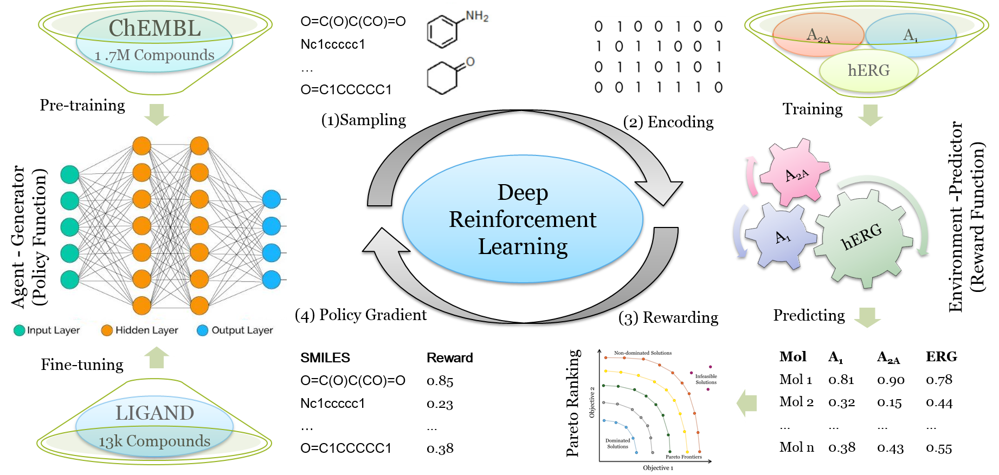
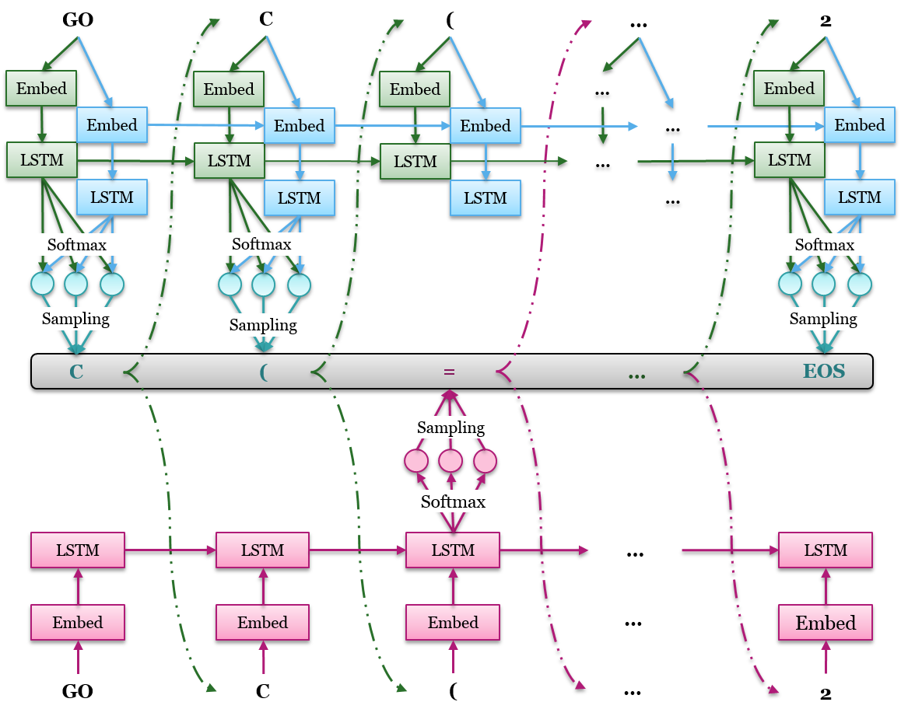
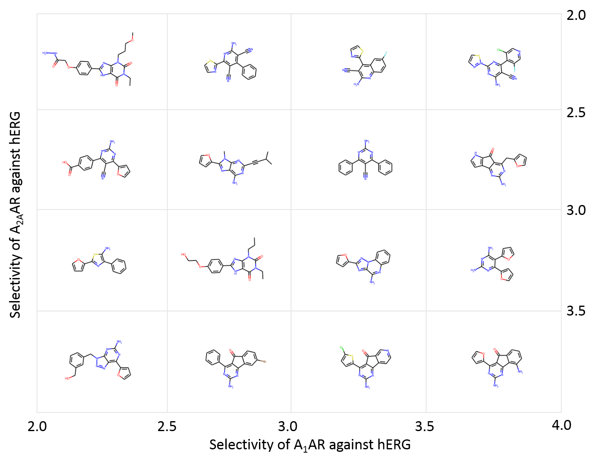
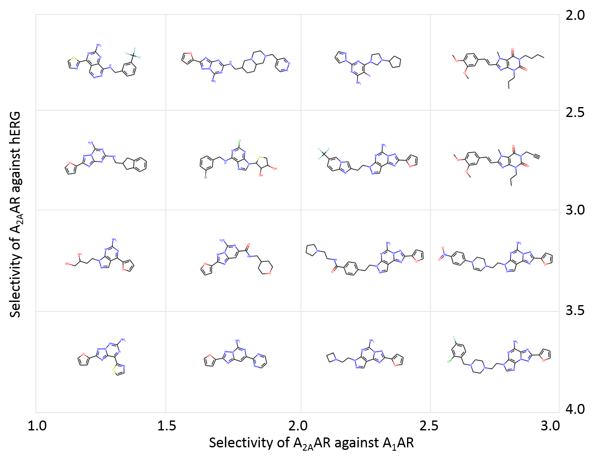

DrugEx RELEASE NOTES
====================

DrugEx v2 (Drug Explorer): De Novo Design of Drug Molecule by Pareto-based Multi-Objective Reinforcement Learning in Polypharmacology

By Xuhan Liu & Gerard J.P. van Westen, on March 8th 2021

Please see the LICENSE file for the license terms for the software. Basically it's free to academic users. If you do wish to sell the software or use it in a commercial product, then please contact us:

   [Xuhan Liu](mailto:x.liu@lacdr.leidenuniv.nl) (First Author): 

   [Gerard J.P. van Westen](mailto:gerard@lacdr.leidenuniv.nl) (Correspondent Author): 

Introduction
=============
After achieving dramatic breakthrough in both image recognition, 
natural language processing and game playing, the deep learning methods 
are increasingly applied in drug discovery, e.g. recurrent neural 
networks (RNNs) have been shown to be an effective method to generate 
molecular libraries in drug discovery. We proposed a new method named 
DrugEx in the previous work that integrates an exploration strategy 
into RNN-based reinforcement learning to improve the diversity of the 
generated molecules. However, most current deep learning-based methods 
focus on a single target to generate drug-like active molecules whereas 
in reality drug molecules often interact with more than one target. 
This can have desired (polypharmacology) or undesired (toxicity) effects. 
Here, we extend our DrugEx algorithm with multi-objective optimization 
and generated drug molecules against more than one specific target 
(two adenosine receptors A1AR, A2AAR and hERG in this study). 
In our model, we applied an RNN as the agent and machine learning 
predictors as the environment, both of which were pre-trained in advance 
and then interplayed under reinforcement learning framework. And the idea 
of evolutionary algorithms was merged into our method such that crossover 
and mutation operations were implemented by the same deep learning model 
as the agent. During the training loop, the agent generates a batch of 
SMILES-based molecules. Subsequently scores for all objectives provided 
by the environment are used for constructing Pareto ranks of the generated 
molecules. Here, we adopted GPU acceleration to speed up the process of 
Pareto optimization. The final reward of each molecule is calculated 
based on the Pareto ranking with the ranking selection algorithm. The agent 
is trained under the guidance of the reward to make sure it can generate 
more desired molecules after convergence of the training process. We 
demonstrate generation of compounds with a diverse predicted selectivity 
profile toward multiple targets, offering the potential of high efficacy 
and lower toxicity.

Workflow
========

Exploration Strategy
====================

Examples
=========
**A: Multi-Target Case**

**B: Target-Specific Case**

Dependencies
============
Firstly, ensure that the version of your Python >= 3.7. 
We recommend Anaconda to manage the version of Python and installed packages.

Secondly, all the following packages are installed in your machine:

**1. [Numpy](https://numpy.org/)** (version >= 1.19)

        $ conda install numpy

**2. [Scikit-Learn](https://scikit-learn.org/stable/)** (version >= 0.23)

        $ conda install scikit-learn

**3. [Pandas](https://pandas.pydata.org/)** (version >= 1.2.2)

        $ conda install pandas

**4. [PyTorch](https://PyTorch.org/)**  (version == 1.6)

        $ conda install pytorch torchvision cudatoolkit=x.x -c pytorch 
    
        Note: it depends on the GPU device and CUDA tookit 
              (x.x is the version of CUDA)

**5. [Matplotlib](https://matplotlib.org/)** (version >= 2.0)

        $ conda install matplotlib
   
**6. [RDKit](https://www.rdkit.org/)** (version >= 2020.03)

        $ conda install -c rdkit rdkit
Usage
======
For designing the novel drug molecules with SMILES representation, you should do the following steps sequentially by running scripts:

1. dataset.py:
 
    Preparing your dataset for pre-training and fine-tuning the RNN model as initial states of exploitation 
    network and exploration network.
    
2. environ.py:

    Training your predictor as the environment for providing the final reward for the action from the agent. 
    The performance can also be evaluated through n-fold cross validation and independent test. 

3. pretrainer.py:

    Pre-training the RNN model as initialization of exploitation network acted as agent for molecule design.
    Fine-tuning the same RNN model as agent net which will be fixed as an pertubation to enlarge the 
    diversity.
    
4. train.py: 

    Training the DrugEx model under the reinforcement learning framework. During the training process, both of 
    the exploitation and exploitation network will be involved in the SMILES generation, and the mutation rate 
    controls the contribution that exploration network makes.
    
5. sampler.py:

    Finally, generating the SMILES format molecules with well-trained RNN model (pre-trained/fine-tuned model 
    or DrugEx model).
    
6. figure.py:

    It provides a variety of the methods to measure the performance of every step during the training process of 
    DrugEx, and form the figure for results visualization.     

        
In addition, this toolkit also provides some other scripts for definition of special data structures, model architectures and coefficient measurements, etc.

1. models/*.py:

    It contains all of the deep learning models that possibly used in this project, including single/multiple 
    fully-connected regression/classification models, RNN generative model and highway CNN classification model.

2. utils/vocab.py: 

    It defines some special data structures, such as vocabulary of SMILES tokens, molecule dataset, environment 
    and some methods for SMILES checking. 
    The statistical methods that extracting properties from generated molecules.

3. utils/metric.py:

    The statistical methods that extracting properties from generated molecules.

4. utils/fingerprints.py:

    There are a variety of chemical fingerprints calculations, such as ECFP, MACCS etc.

5. utils/modifier.py

    It provides a variety of desirability function to normalize the scoring furntions. 
    For more details, please check [GuacaMol](https://pubs.acs.org/doi/10.1021/acs.jcim.8b00839) benchemark.

6. utils/objective.py

    It provides the construction of different scoring functions, including similary score,
    chemical properties, QSAR modelling, etc. Moreoever, it can also integrate multiple 
    objective into an environment to calculate reward for the agent. 

7. utils/nsgaii.py

    The implementation of non-dominate sorting and crowding distance algorithm (NSGAII). 
    Importantly, we employ PyTorch to accelerate its performance and also modify the
    calculation of crowding distance with Tanimoto-distance.

8. utils/sacorer.py  
  
    The implementation of SA score to measure the synthezability score of each molecule.
    More details about SA score can be found [here](https://jcheminf.biomedcentral.com/articles/10.1186/1758-2946-1-8)

References
==========

1. [Liu X, AP IJ, van Westen GJP. Computational Approaches for De Novo Drug Design: Past, Present, and Future. Methods Mol Biol. 2021;2190:139-65.](https://link.springer.com/protocol/10.1007%2F978-1-0716-0826-5_6)

2. [Liu X, Ye K, van Vlijmen HWT, AP IJ, van Westen GJP. An exploration strategy improves the diversity of de novo ligands using deep reinforcement learning: a case for the adenosine A2A receptor. Journal of cheminformatics. 2019;11(1):35.](https://jcheminf.biomedcentral.com/articles/10.1186/s13321-019-0355-6)

Acknowledgement
===============
We thank the following Git repositories that gave me a lot of inspirations:
   
1. [REINVENT](https://github.com/MarcusOlivecrona/REINVENT)
2. [ORGAN](https://github.com/gablg1/ORGAN)
3. [SeqGAN](https://github.com/LantaoYu/SeqGAN)

