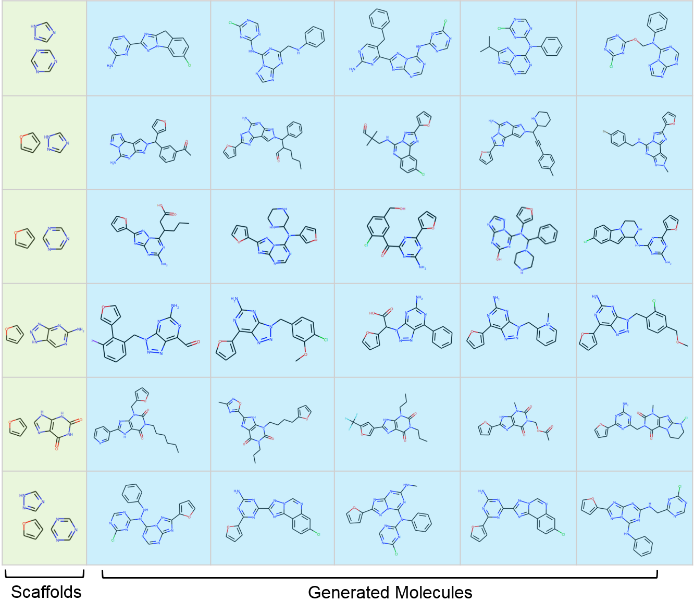

DrugEx RELEASE NOTES (v3)
====================

<b>Drug Explorer (DrugEx v3)</b>: Scaffold-Constrained Drug Design with Graph Transformer-based Reinforcement Learning

By Xuhan Liu & Gerard J.P. van Westen, on January 28th 2022

Please see the LICENSE file for the license terms for the software. Basically it's free to academic users. If you do wish to sell the software or use it in a commercial product, then please contact us:

   [Xuhan Liu](mailto:xuhanliu@hotmail.com) (First Author): xuhanliu@hotmail.com 

   [Gerard J.P. van Westen](mailto:gerard@lacdr.leidenuniv.nl) (Correspondent Author): gerard@lacdr.leidenuniv.nl 

"A small step for exploring the drug space in need, A giant leap for exploiting a healthy state indeed"

Introduction
=============

Due to the large drug-like chemical space available to search for feasible drug-like molecules, rational drug design often starts from specific scaffolds to which side chains/substituents are added or modified. With the rapid growth of the application of deep learning in drug discovery, a variety of effective approaches have been developed for de novo drug design. In previous work, we proposed a method named DrugEx, which can be applied in polypharmacology based on multi-objective deep reinforcement learning. However, the previous version is trained under fixed objectives similar to other known methods and does not allow users to input any prior information (i.e. a desired scaffold). In order to improve the general applicability, we updated DrugEx to design drug molecules based on scaffolds which consist of multiple fragments provided by users. In this work, the Transformer model was employed to generate molecular structures. The Transformer is a multi-head self-attention deep learning model containing an encoder to receive scaffolds as input and a decoder to generate molecules as output. In order to deal with the graph representation of molecules we proposed a novel positional encoding for each atom and bond based on an adjacency matrix to extend the architecture of the Transformer. Each molecule was generated by growing and connecting procedures for the fragments in the given scaffold that were unified into one model. Moreover, we trained this generator under a reinforcement learning framework to increase the number of desired ligands. As a proof of concept, our proposed method was applied to design ligands for the adenosine A2A receptor (A2AAR) and compared with SMILES-based methods. The results demonstrated the effectiveness of our method in that 100% of the generated molecules are valid and most of them had a high predicted affinity value towards A2AAR with given scaffolds. 

<b>Keywords</b>: deep learning, reinforcement learning, policy gradient, drug design, Transformer, multi-objective optimization

Workflow
========

Deep learning Architectures
====================

Examples
=========

Dependencies
============
Firstly, ensure that the version of your Python >= 3.7. 
We recommend Anaconda to manage the version of Python and installed packages.

Secondly, all the following packages are installed in your machine:

**1. [Numpy](https://numpy.org/)** (version >= 1.19)

        $ conda install numpy

**2. [Scikit-Learn](https://scikit-learn.org/stable/)** (version >= 0.23)

        $ conda install scikit-learn

**3. [Pandas](https://pandas.pydata.org/)** (version >= 1.2.2)

        $ conda install pandas

**4. [PyTorch](https://PyTorch.org/)**  (version == 1.7)

        $ conda install pytorch torchvision cudatoolkit=x.x -c pytorch 
    
        Note: it depends on the GPU device and CUDA tookit 
              (x.x is the version of CUDA)

**5. [Matplotlib](https://matplotlib.org/)** (version >= 2.0)

        $ conda install matplotlib
   
**6. [RDKit](https://www.rdkit.org/)** (version >= 2020.03)

        $ conda install -c rdkit rdkit
Usage
======
For designing the novel drug molecules with SMILES representation, you should do the following steps sequentially by running scripts:

1. dataset.py:
 
    Preparing your dataset for pre-training and fine-tuning the RNN model as initial states of exploitation 
    network and exploration network.
    
2. environ.py:

    Training your predictor as the environment for providing the final reward for the action from the agent. 
    The performance can also be evaluated through n-fold cross validation and independent test. 

3. train_graph.py:

    Pre-training an training the graph transformer model with graph representation under supervision and reinforcement learning frameworks, respectively.
    
4. train_smiles.py: 

    Pre-training an training the SMILES-based deep learning models with SMILES representation under supervision and reinforcement learning frameworks, respectively.
    
    
5. designer.py:

    Finally, generating molecules with well-trained deep learning model with either graph or SMILES representations. 
6. plot.py:

    It provides a variety of the methods to measure the performance of every step during the training process of 
    DrugEx, and form the figure for results visualization.     

        
In addition, this toolkit also provides some other scripts for definition of special data structures, model architectures and coefficient measurements, etc.

1. models/*.py:

    It contains all of the deep learning models that possibly used in this project, including single/multiple 
    fully-connected regression/classification models, RNN generative model and highway CNN classification model.

2. utils/vocab.py: 

    It defines some special data structures, such as vocabulary of SMILES tokens and elements in the graph, molecule dataset, environment 
    and some methods for SMILES and graph checking. 
    The statistical methods that extracting properties from generated molecules.

3. utils/metric.py:

    The statistical methods that extracting properties from generated molecules.

4. utils/fingerprints.py:

    There are a variety of chemical fingerprints calculations, such as ECFP, MACCS etc.

5. utils/modifier.py

    It provides a variety of desirability function to normalize the scoring functions. 
    For more details, please check [GuacaMol](https://pubs.acs.org/doi/10.1021/acs.jcim.8b00839) benchmark.

6. utils/objective.py

    It provides the construction of different scoring functions, including similarly score,
    chemical properties, QSAR modelling, etc. Moreoever, it can also integrate multiple 
    objective into an environment to calculate reward for the agent. 

7. utils/nsgaii.py

    The implementation of non-dominate sorting and crowding distance algorithm (NSGAII). 
    Importantly, we employ PyTorch to accelerate its performance and also modify the
    calculation of crowding distance with Tanimoto-distance.

8. utils/sacorer.py  
  
    The implementation of SA score to measure the synthezability score of each molecule.
    More details about SA score can be found [here](https://jcheminf.biomedcentral.com/articles/10.1186/1758-2946-1-8)

References
==========

1. [Liu X, IJzerman AP, van Westen GJP. Computational Approaches for De Novo Drug Design: Past, Present, and Future. Methods Mol Biol. 2021;2190:139-65.](https://link.springer.com/protocol/10.1007%2F978-1-0716-0826-5_6)

2. [Liu X, Ye K, van Vlijmen HWT, IJzerman AP, van Westen GJP. DrugEx v3: Scaffold-Constrained Drug Design with Graph Transformer-based Reinforcement Learning. Preprint](https://chemrxiv.org/engage/chemrxiv/article-details/61aa8b58bc299c0b30887f80)

3. [Liu X, Ye K, van Vlijmen HWT, Emmerich MTM, IJzerman AP, van Westen GJP. DrugEx v2: De Novo Design of Drug Molecule by Pareto-based Multi-Objective Reinforcement Learning in Polypharmacology. Journal of cheminformatics 2021:13(1):85.](https://doi.org/10.1186/s13321-021-00561-9) 

4. [Liu X, Ye K, van Vlijmen HWT, IJzerman AP, van Westen GJP. An exploration strategy improves the diversity of de novo ligands using deep reinforcement learning: a case for the adenosine A2A receptor. Journal of cheminformatics. 2019;11(1):35.](https://jcheminf.biomedcentral.com/articles/10.1186/s13321-019-0355-6)

Acknowledgement
===============
We thank the following Git repositories that gave me a lot of inspirations:
   
1. [REINVENT](https://github.com/MarcusOlivecrona/REINVENT)
2. [ORGAN](https://github.com/gablg1/ORGAN)
3. [SeqGAN](https://github.com/LantaoYu/SeqGAN)

